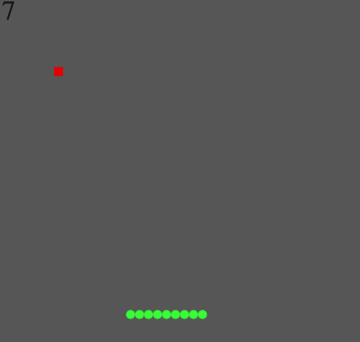
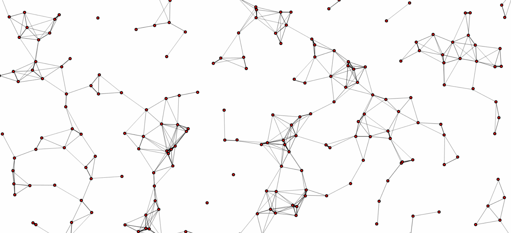
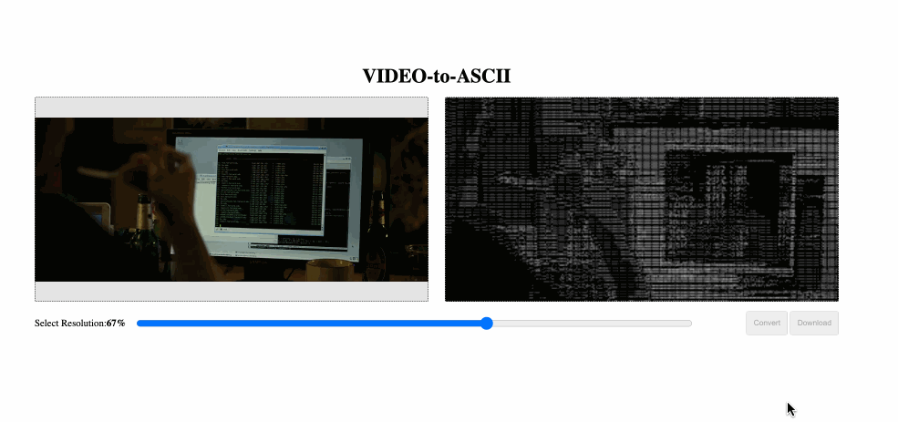
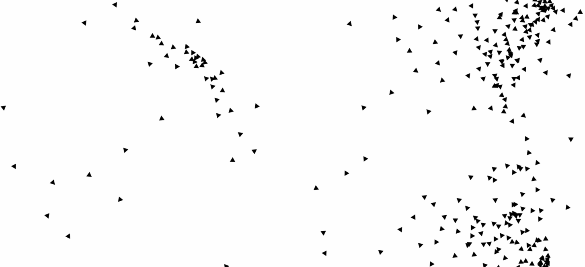

# 🧩 Collection

Welcome to **Collection** – a curated collection of small but powerful projects that depict various types of simulations, games or experiments that were made in a day or a few hours. 

---

## 🔍 Projects Include

### 🎮 Snake

- **Description**: Snake game made under 11 minutes as a challenge against another developer. Handles snake death, growth, and a point system
- **Tech**: HTML5 Canvas, Vaniila JS, DOM Manipulation

---

### 🖼️ Pattern

- **Description**: A seamless canvas dynamic pattern.
- **Stack**: HTML5 Canvas, Vaniila JS, DOM Manipulation

---

### 🎥 Video to ASCII Art Converter

- **Description**: Converts video frames into animated ASCII art using canvas and pixel data.
- **Tech**: HTML5 Canvas, Vanilla JS, DOM Manipulation, Media Source

---

### 🍴 Boid Simulation

- **Description**: Simulates the movement pattern of birds/fishes following a simple set of rules.
- **Tech**: HTML5 Canvas, Vanilla JS, DOM Manipulation

---

### 🍴 MandelBrot & Julia Set

- **Description**: Simulates the Mandelbrot and Julia set, which are famous fractals of the complex plane.
- **Tech**: HTML5 Canvas, Vanilla JS, DOM Manipulation, C++, SDL2

---

### 🍴 Verlet Integraion Simulation

- **Description**: Uses reverse kinematics to simulate and display, interactive dynamic cloth/rope simulation
- **Tech**: HTML5 Canvas, Vanilla JS, DOM Manipulation, C++, SDL2, Aseprite

---

### 🍴 Physics Simulation

- **Description**: Implements and allows simulation of a variety of Newtonian physics.
- **Tech**: C++, SDL2, 
